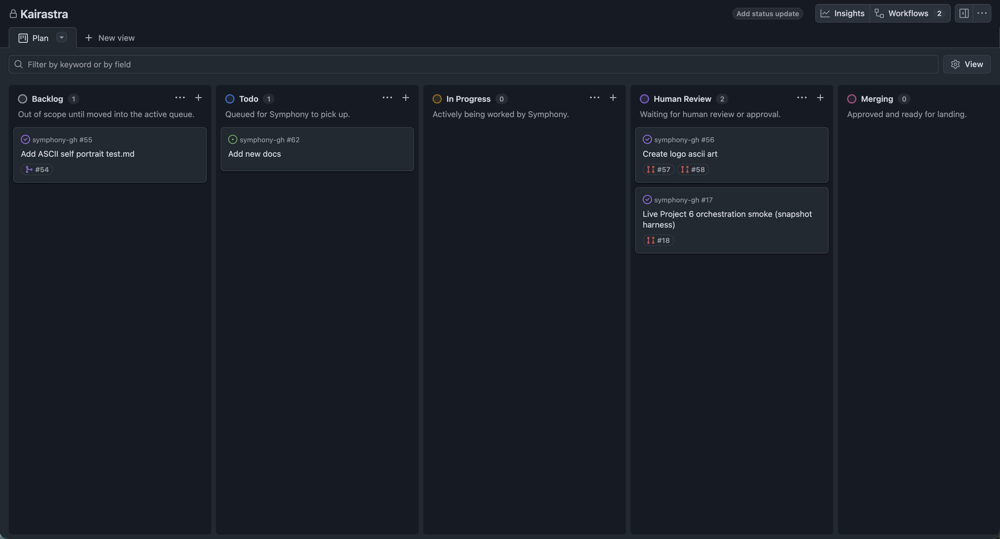

<!--
Derived from OpenAI Symphony and modified for Kairastra.
Copyright 2025 OpenAI
Copyright 2026 Dzmitry Bachko and contributors
SPDX-License-Identifier: Apache-2.0
-->


[](https://github.com/dbachko/kairastra/actions/workflows/ci.yml)
[](https://github.com/dbachko/kairastra/blob/main/LICENSE)
[](https://github.com/dbachko/kairastra/tags)
[](https://github.com/dbachko/kairastra/blob/main/docs/workflow-reference.md)

Kairastra is a GitHub-native autonomous work runner. It watches a GitHub issue queue, creates an
isolated workspace per issue, runs a coding agent, and hands work back as pull requests, workpad
updates, and review-ready state changes.



> [!WARNING]
> Kairastra is intended for trusted environments.

## Relation To Symphony

Kairastra is an opinionated Rust implementation of
[OpenAI Symphony](https://github.com/openai/symphony), adapted around a GitHub-native,
one-repository-per-deployment operating model and multi-provider agent execution.

## What It Does

- Watches GitHub Issues or Projects v2 for claimable work.
- Creates isolated per-issue workspaces on the host filesystem.
- Runs one selected worker provider per workflow via `agent.provider`; built-ins are `codex`,
  `claude`, and `gemini`.
- Keeps issue workpad comments, PR discovery, and review handoff in sync with execution.

## Quick Start

Kairastra is now native-first. The supported path is to install the binary on your host, generate a
workflow, and run it directly.

Install from source:

```bash
curl -fsSL https://raw.githubusercontent.com/dbachko/kairastra/main/install.sh | bash
```

Requirements:

- Rust and Cargo on the host
- `git` and `gh`
- the provider CLI you plan to use: `codex`, `claude`, or `gemini`

> [!IMPORTANT]
> Codex is the default and best-tested provider path today. Kairastra can run issue workers with
> `agent.provider: codex`, `claude`, or `gemini`, but if you want the supported default path,
> install `codex` first and start there.

Then generate the native config:

```bash
krstr setup
krstr auth menu
krstr doctor
krstr run
```

`krstr setup` now also:

- creates `.github/` when the repo is otherwise too empty for workspace bootstrap
- adds `.kairastra/` to local Git ignore rules
- inspects required GitHub labels and Project fields
- asks before applying GitHub label or Project-field changes interactively
- stays read-only against GitHub in `--non-interactive` mode unless `--bootstrap-github` is set

## First Successful Run

You are set up correctly when all of these are true:

- `krstr doctor` passes.
- Provider auth is configured.
- A repo issue is in a claimable state.
- Kairastra creates a workspace under your configured workspace root.
- The issue gets a workpad update and Kairastra starts or discovers the PR flow.

## End-To-End Example

1. An issue enters `Todo` or another claimable state in your repo queue.
2. Kairastra claims it and moves it into the configured in-progress state.
3. It creates an isolated git worktree from your local repository and runs the selected agent there.
4. The agent edits code, opens or updates a branch and PR, and writes progress into the issue
   workpad comment.
5. GitHub checks and PR status become visible from the same issue lifecycle.
6. Kairastra hands the issue back in a human-review state, or reconciles it to done when the issue
   is closed and the workflow allows automatic completion.

## Main Commands

| Command | What it does |
| --- | --- |
| `krstr run` | Start the orchestrator loop using repo-root `WORKFLOW.md` by default. |
| `krstr run --once` | Run one dispatch pass and wait for started workers before exit. |
| `krstr setup` | Generate repo-root `WORKFLOW.md`, `.kairastra/kairastra.env`, add `.kairastra/` to `.gitignore`, sync required `.agents/skills/` workflow skills into the repo with confirmation, scaffold repo support dirs, and optionally bootstrap GitHub metadata. |
| `krstr setup --reconfigure` | Re-run setup and overwrite the generated local Kairastra files for the current repo. |
| `krstr doctor` | Validate workflow, GitHub connectivity, local commands, auth state, and GitHub metadata readiness. |
| `krstr auth status` | Show provider auth status. |
| `krstr auth menu` | Recommended default auth flow. Inspect providers and run the right login interactively. |
| `krstr auth login --mode subscription` | Run browser, device, or account login for the default provider. Prefer `krstr auth menu` unless you need to force this path. |
| `krstr auth login --mode api-key` | Configure API-key auth for the default provider. Prefer `krstr auth menu` unless you need to force this path. |

`krstr` is a thin wrapper installed alongside `kairastra`, so both command names work.

## Configuration

`WORKFLOW.md` is the main control surface for Kairastra.

- One workflow owns both runtime settings and prompt behavior.
- The repo-root `WORKFLOW.md` is the canonical workflow template.
- `krstr setup` writes operator files under `.kairastra/` by default.
- The generated repo-root `WORKFLOW.md` keeps setup-specific front matter and uses the canonical prompt body from the repo root template.
- The runtime reads `WORKFLOW.md` directly from the host filesystem.
- The generated env file keeps machine-specific settings and secrets outside the workflow file.

Use [docs/workflow-reference.md](docs/workflow-reference.md) for the schema and operational rules.

## Read More

- [rust/README.md](rust/README.md): native runtime guide and source-based operation
- [docs/auth.md](docs/auth.md): GitHub token and provider auth guidance
- [docs/deployment.md](docs/deployment.md): native deployment and service setup details
- [docs/operations.md](docs/operations.md): doctor checks, day-2 operations, and limitations
- [docs/workflow-reference.md](docs/workflow-reference.md): `WORKFLOW.md` structure and behavior
- [docs/architecture.md](docs/architecture.md): runtime architecture and execution model
- [docs/troubleshooting.md](docs/troubleshooting.md): setup and runtime failure modes
- [SPEC.md](SPEC.md): normative service contract

## License

This project is licensed under the [Apache License 2.0](LICENSE).
